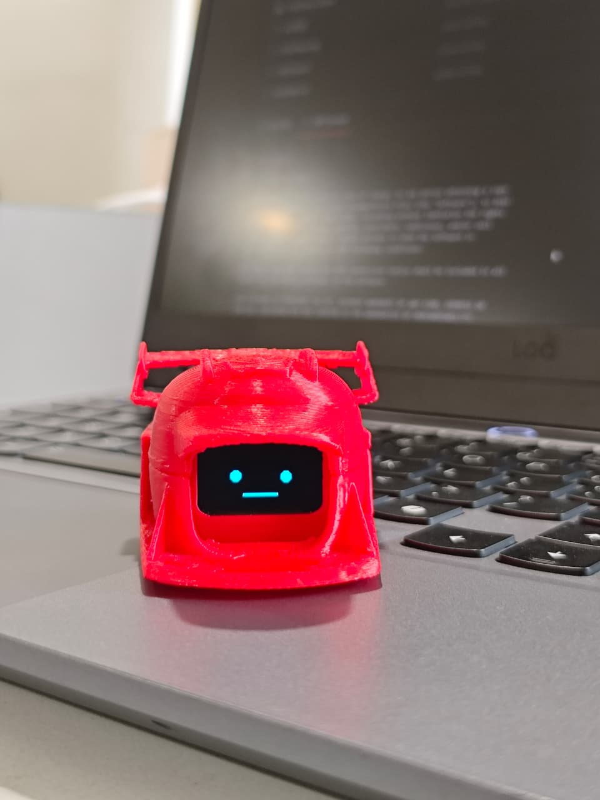
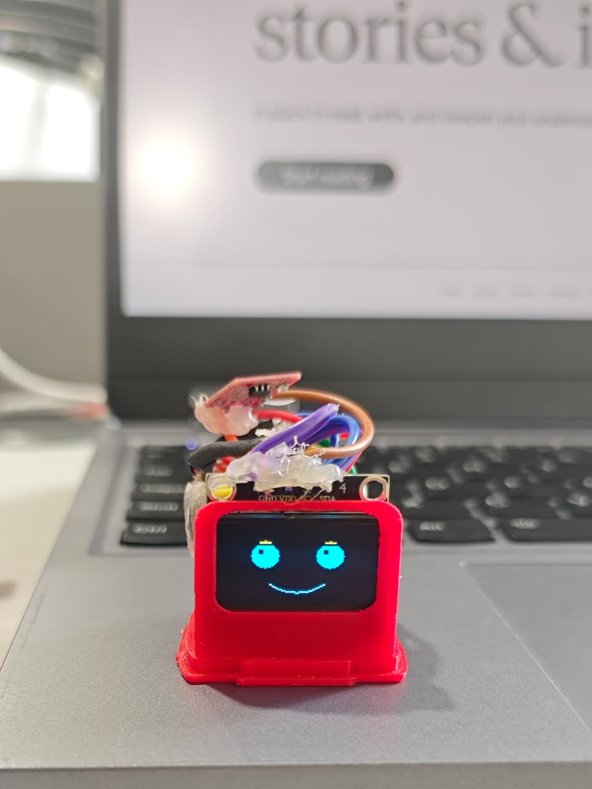
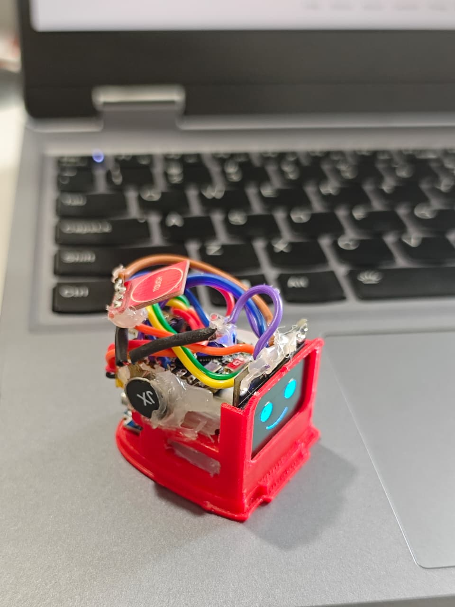
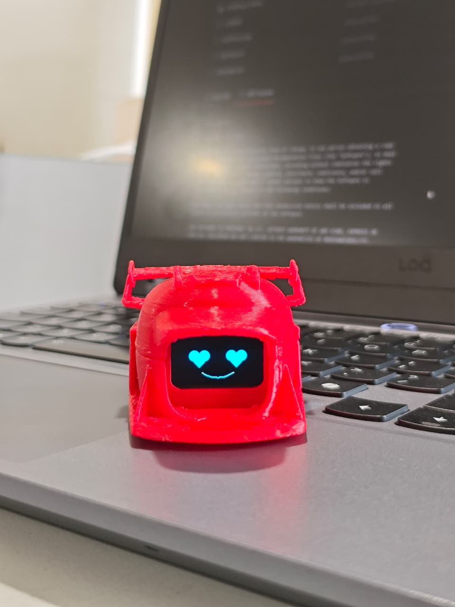
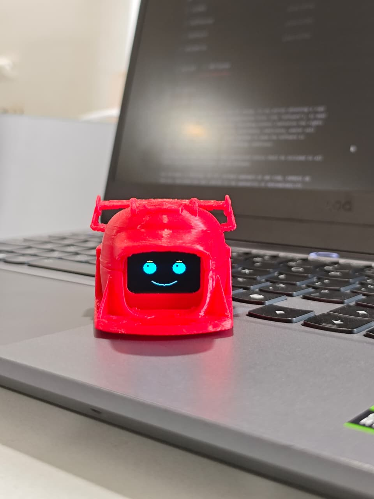

# KawaiiRobo Web Edition

### ESP32-C3 Super Mini Interactive OLED Robot


KawaiiRobo is an expressive interactive robot built on the ESP32-C3 Super Mini using a custom OLED animation framework and a non-blocking multitasking architecture. The project combines animated facial expressions, touch gestures, haptic feedback, and a fully asynchronous web interface to create a responsive robotic personality system on compact embedded hardware.

The robot is powered by the custom **OLEDFace v2.0** rendering engine, capable of displaying smooth animations, emotion states, scrolling messages, symbols, and interactive expressions on a 1.3-inch SSD1306 OLED display.

---

## Features

* 44 animated OLED scenes and expressions
* Real-time async web dashboard
* Touch gesture recognition
* Emotion state engine
* Non-blocking multitasking architecture
* Haptic vibration feedback system
* WiFi Access Point mode
* Dynamic text and message rendering
* FPS control system
* Automatic sleep and wake handling
* Modular scene-based rendering engine

---

## Hardware Used

| Component     | Details                 |
| ------------- | ----------------------- |
| MCU           | ESP32-C3 Super Mini     |
| Display       | 1.3" SSD1306 OLED       |
| Input         | Capacitive touch sensor |
| Haptics       | Vibration motor         |
| Driver        | NPN transistor driver   |
| Communication | WiFi AP mode            |

---

## Pin Configuration

| Component | GPIO   |
| --------- | ------ |
| OLED SDA  | GPIO 8 |
| OLED SCL  | GPIO 9 |
| Touch OUT | GPIO 4 |
| Motor PWM | GPIO 2 |

## OLED Animation Engine

KawaiiRobo uses the custom **OLEDFace v2.0** framework for rendering animated expressions and dynamic scenes.

Supported systems include:

* Emotion rendering
* Animated transitions
* Tick-based rendering
* Scrolling messages
* Name display system
* Symbol rendering
* FPS-based animation timing

---

## Emotion System

The robot supports multiple emotional states:

* Idle
* Curious
* Very Curious
* Angry
* Confused
* Cuddle
* Sad
* Happy
* Sleepy
* Love

Each emotion maps to:

* A dedicated OLED scene
* A haptic vibration pattern
* Automatic timing behavior

---

## Touch Gesture Controls

| Gesture      | Action         |
| ------------ | -------------- |
| Single tap   | Curious        |
| Double tap   | Cycle emotion  |
| Triple tap   | Angry          |
| 5 rapid taps | Confused       |
| Long press   | Cuddle         |
| Idle 5s      | Return to idle |
| Idle 2 min   | Light sleep    |

---

## Web Dashboard

The ESP32 hosts a fully asynchronous web interface accessible through WiFi AP mode.

### Access

```txt id="dc8k6u"
SSID: KawaiiRobo
Password: 12345678
```

Open:

```txt id="v4vmk1"
http://192.168.4.1
```

### Dashboard Features

* Live scene selection
* Emotion controls
* Gesture simulator
* Name display input
* Message scrolling
* FPS slider
* Sleep controls
* Live status monitoring

---

## Software Architecture

KawaiiRobo uses a cooperative multitasking architecture built entirely without blocking delays.

Core systems include:

* OLED rendering task
* Touch polling task
* Haptic controller
* Emotion state machine
* Async web server
* Sleep manager
* Scene manager

The system is designed around millis()-based scheduling for responsive real-time behavior.

---

## Libraries Required

Install using Arduino Library Manager:

* Adafruit SSD1306
* Adafruit GFX Library
* ESPAsyncWebServer
* AsyncTCP

---

## Folder Structure

```txt id="jlsvgh"
KawaiiRobo/
│
├── KawaiiRobo_Web.ino
├── OLEDFace.h
├── OLEDFace.cpp
├── images/
├── docs/
└── README.md
```

---

## Power Management

The robot automatically enters light sleep mode after inactivity to reduce power consumption.

Features include:

* OLED blanking
* WiFi shutdown during sleep
* GPIO wake support
* Automatic recovery after wake

---

## Project Goals

KawaiiRobo was created as an experimental embedded personality platform focused on:

* Efficient OLED animation systems
* Lightweight robotic UI rendering
* Non-blocking embedded firmware
* Responsive interaction systems
* Emotion-driven robotic behavior

---

## Future Improvements

* Voice interaction
* AI-driven emotion system
* MQTT integration
* Mobile companion app
* Battery monitoring
* Multi-device communication

---

---

## Images

### KawaiiRobo Showcase

| Preview | Description |
|---|---|
|  | Main front view of KawaiiRobo |
|  | OLED facial animation demo |
|  | Web UI interaction preview |
|  | Hardware and assembly view |
|  | Final project showcase |

---

### Gallery

#### Main Robot


#### OLED Expressions


#### Web Dashboard


#### Hardware Setup


#### Final Build


---

---

## License

MIT License

---

## Author

Built and designed by SREERAGH K using the ESP32-C3 Super Mini and a custom OLED graphics framework for expressive embedded robotics.
